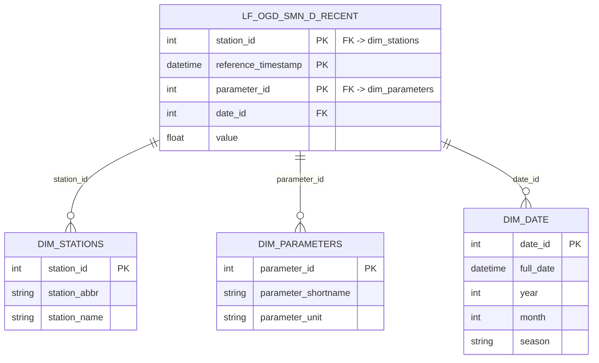

Resource group: rg-meteoschweiz-dev
Region: Switzerland North (data residency + geographic proximity)

MeteoSchweiz API 

    ↓ (download_data.py)

Local CSVs 

    ↓ (upload_to_adls.py)
      note: download + upload combined in update_data_adls.zsh
      
Azure Data Lake Storage Gen2 (raw/)

    ↓ (Databricks notebook)

Databricks

    ↓ (Databricks: read, reshape to long format,  upsert)

    ├─→ Azure Data Lake Storage Gen2 (processed/)  [long-format Parquet]

    └─→ Azure SQL Database (long-format table, append mode (filter via last timestamp in db))

                ↓

            Power BI

## Components

- **Azure Data Lake Storage Gen2**: Stores raw CSV files in hierarchical structure
- **Azure Databricks**: Python-based data processing and transformation
- **Azure SQL Database**: OLAP data warehouse for analytical queries
- **Power BI**: Visualization and dashboard layer

## Star Schema

**Fact table**: `[lf-ogd-smn_d_recent]` — composite primary key on `(station_id, reference_timestamp, parameter_id)` together (all three marked `PK` above, since Mermaid doesn't have separate notation for "composite key member" vs. "single-column key" — read the three as jointly forming one key, not as three independent primary keys). `date_id` is a foreign key for calendar grouping only, excluded from the uniqueness constraint to allow future finer-than-daily granularity.

**Legacy**: `[legacy_ogd-smn_d_recent]` (wide format, superseded by the star schema above) retained for historical reference; not part of the active pipeline.