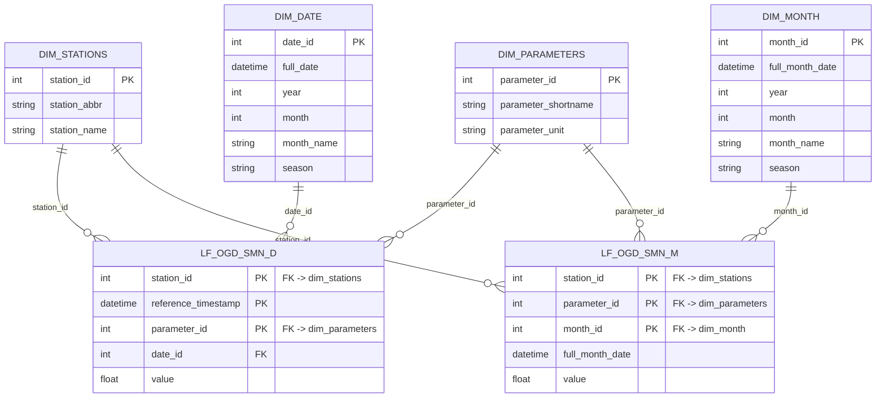

Resource group: rg-meteoschweiz-dev
Region: Switzerland North (data residency + geographic proximity)

MeteoSchweiz API 

    ↓ (download_data.py)

Local CSVs 

    ↓ (upload_to_adls.py)
      note: download + upload combined in update_data_adls.zsh
      
Azure Data Lake Storage Gen2 (raw/)

    ↓ (Databricks notebook)

Databricks

    ↓ (Databricks: read, reshape to long format,  upsert)

    ├─→ Azure Data Lake Storage Gen2 (processed/)  [long-format Parquet]

    └─→ Azure SQL Database (long-format table, append mode (filter via last timestamp in db))

                ↓

            Power BI

## Components

- **Azure Data Lake Storage Gen2**: Stores raw CSV files in hierarchical structure
- **Azure Databricks**: Python-based data processing and transformation
- **Azure SQL Database**: OLAP data warehouse for analytical queries
- **Power BI**: Visualization and dashboard layer

## Star Schema (Fact Constellation)

Two fact tables at different grains share the station and parameter dimensions. Each has its own time dimension.

```mermaid
erDiagram
    DIM_STATIONS ||--o{ LF_OGD_SMN_D : station_id
    DIM_PARAMETERS ||--o{ LF_OGD_SMN_D : parameter_id
    DIM_DATE ||--o{ LF_OGD_SMN_D : date_id
    DIM_STATIONS ||--o{ LF_OGD_SMN_M : station_id
    DIM_PARAMETERS ||--o{ LF_OGD_SMN_M : parameter_id
    DIM_MONTH ||--o{ LF_OGD_SMN_M : month_id

    LF_OGD_SMN_D {
        int station_id PK "FK -> dim_stations"
        datetime reference_timestamp PK
        int parameter_id PK "FK -> dim_parameters"
        int date_id FK
        float value
    }

    LF_OGD_SMN_M {
        int station_id PK "FK -> dim_stations"
        int parameter_id PK "FK -> dim_parameters"
        int month_id PK "FK -> dim_month"
        datetime full_month_date
        float value
    }

    DIM_STATIONS {
        int station_id PK
        string station_abbr
        string station_name
    }

    DIM_PARAMETERS {
        int parameter_id PK
        string parameter_shortname
        string parameter_unit
    }

    DIM_DATE {
        int date_id PK
        datetime full_date
        int year
        int month
        string month_name
        string season
    }

    DIM_MONTH {
        int month_id PK
        datetime full_month_date
        int year
        int month
        string month_name
        string season
    }
```

**Daily fact** `[lf-ogd-smn_d]`: composite primary key `(station_id, reference_timestamp, parameter_id)`. `date_id` is a foreign key only, kept out of the PK so finer-than-daily data could be added later without breaking uniqueness.

**Monthly fact** `[lf-ogd-smn_m]`: composite primary key `(station_id, parameter_id, month_id)`. `month_id` belongs in the PK because no finer grain is planned. Created explicitly with all constraints upfront, not auto-generated by Spark, so no constraint backfill was needed.

`value` is nullable on both fact tables because missing measurements exist in the source data.

**Why two fact tables**: mixing daily and monthly rows in one table would make the meaning of a row ambiguous.

**Legacy**: `[legacy_ogd-smn_d_recent]` (wide format, superseded) is retained for reference and is not part of the active pipeline.

## Data Scope Decisions

- **Daily**: current year only (`_d_recent` files), loaded incrementally (max-timestamp filter, then append).
- **Monthly**: 1975 onward (50 years), loaded through the same route (MeteoSchweiz, then local, ADLS `raw/`, Databricks, Azure SQL), with a `dim_month` join in place of `dim_date`.
- **Daily history was not loaded.** A backfill of 2000 onward was started, but the Basic tier's 2 GB limit made it impractical, and daily granularity isn't needed to compare this year against historical averages. The partial load was deleted and monthly data replaced it.

**Open item**: how new months get added to `[lf-ogd-smn_m]` over time (re-run, incremental append, or leave static) is not decided yet.

## Infrastructure as Code (Terraform)

Terraform manages the five core, stable Azure resources: `rg-meteoschweiz-dev`, the storage account `nkipermeteodata001`, the SQL server `sqls-nkipermeteo-dev`, the database `db-nkipermeteo`, and the Databricks workspace `dbw-nkipermeteo-dev`.

**Deliberately out of scope:**
- The Databricks **cluster** — started and stopped manually as needed; not a stable, long-lived resource and not a good fit for static IaC.
- **Table schemas and data** — every table, dimension, fact table, constraint, and row is managed by the project's own Python scripts and the Databricks notebook, not by Terraform. Terraform's job stops at "does the SQL server and database exist with the right settings," not what's inside the database.
- Azure resources used only transiently (e.g., a temporary DTU tier bump for a large load) are not modeled in Terraform at all.

**State and secrets**: `terraform.tfstate`, `terraform.tfstate.backup`, and `terraform.tfvars` are git-ignored and never committed. `.terraform.lock.hcl` is committed (provider version/checksums only, no resource data). The SQL admin password is passed as a `sensitive` Terraform variable. `ephemeral` is not supported for `administrator_login_password` on this resource (the provider requires it to persist to state), so the password is present, in plain text, inside the local state file — the main reason `terraform.tfstate` must never be committed or shared.

**Known limitation**: `terraform import` only populates Terraform's state, never the configuration file. A resource block with too few arguments can produce a `plan` that looks like a routine update but is actually a destructive replace, or a silent drift toward a provider's default that overrides a deliberate earlier setting. Every `plan` should be read in full — not just the summary line — before applying, specifically checking for `# forces replacement`.