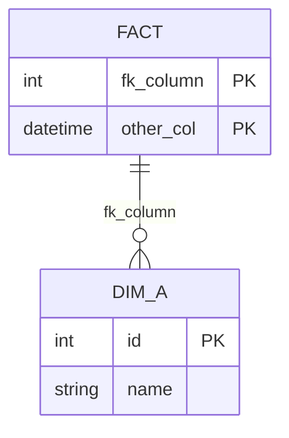

# Lesson 7 Cheatsheet: Date Dimension & Schema Documentation

## Date Dimension Pattern

```python
import pandas as pd

seasons = ['Winter', 'Spring', 'Summer', 'Fall']
dti = pd.date_range('2026-01-01', periods=365, freq='d')

for dt in dti:
    row = [
        dt,                                    # full_date (DATETIME)
        dt.year,
        dt.month,
        dt.month_name(),
        seasons[dt.month % 12 // 3],            # meteorological season
        dt.year*10**4 + dt.month*10**2 + dt.day # YYYYMMDD surrogate key
    ]
```
- `month % 12 // 3` maps Dec→0, Jan→1, Feb→2 ... Nov→11, then groups into 4 meteorological-season buckets starting from December
- `YYYYMMDD` int key: sortable, human-readable; keep a real `DATE`/`DATETIME` column too — the int alone can't do native date arithmetic or join cleanly against a `DATETIME` fact column

## Casting Before Joining on Dates (avoid silent time-component mismatches)

```sql
-- SQL
ON CAST(fact.reference_timestamp AS DATE) = CAST(dim.full_date AS DATE)
```
```python
# PySpark
.join(dim_date.select(dim_date.full_date.cast("date").alias("day"), "date_id"),
      on=(col("day") == df_long.reference_timestamp.cast("date")),
      how="left"
).drop("day")
```

## PySpark Join `on=` Rules

- A column used in `on=` must exist in the DataFrame actually being joined — referencing a column from a *different* (even related/parent) DataFrame raises `Cannot resolve dataframe column`, even if they share lineage
- `on=` needs a real equality expression (`col_a == col_b`) when both sides don't share a literal column name — a bare string is not a valid join condition
- If a column is only needed to make the join condition resolvable (not needed in the final output), include it in `.select(...)` for the join, then `.drop(...)` it afterward

## Fact Table Composite Key Design

`(station_id, reference_timestamp, parameter_id)` — the actual uniqueness guarantee.
`date_id` — foreign key only, **not** in the PK: it's derived from (less granular than) `reference_timestamp`, so including it would break if finer-than-daily data is ever added.

## Constraint Backfill Sequence (for any new FK on existing data)

```sql
ALTER TABLE t ADD new_col INT;                          -- 1. nullable
GO
UPDATE t SET new_col = ... FROM t JOIN dim ON ...;       -- 2. populate
SELECT COUNT(*) FROM t WHERE new_col IS NULL;            -- 3. verify = 0 BEFORE proceeding
ALTER TABLE t ALTER COLUMN new_col INT NOT NULL;         -- 4. only after verifying
ALTER TABLE t ADD CONSTRAINT fk FOREIGN KEY (new_col) REFERENCES dim(id); -- 5. last
```
⚠️ Don't trust "should have been added earlier" — check `sys.foreign_keys` / `sys.key_constraints` directly rather than assuming a past step succeeded.

## Renaming a Table

```sql
EXEC sp_rename '[old_name]', 'new_name';
SELECT name FROM sys.tables WHERE name LIKE '%new_name%';  -- verify
```
Produces a standard caution about breaking dependent scripts — expected, not an error, if nothing genuinely depends on the old name.

## Renaming Tracked Files (preserve Git history)

```bash
git mv old_name.py new_name.py
```
Prefer this over OS-level rename or delete+recreate for tracked files.

## Mermaid ER Diagram (renders natively in GitHub markdown)


- `||--o{` = one dimension row to many fact rows (standard star-schema cardinality)
- No native support for marking multiple columns as one *composite* key distinctly from several independent single-column keys — mark all contributing columns `PK` and clarify with a prose note alongside the diagram